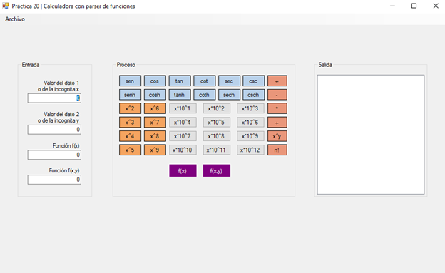

# Práctica 20

Elaboración de una aplicación con `Windows Forms` que funcione como una calculadora con:

- Operaciones aritméticas básicas
- Identidades trigonométricas
- Operaciones adicionales
- Parser para resolver funciones de una variable `x`
- Parser para resolver funciones de dos variables `x` & `y`

